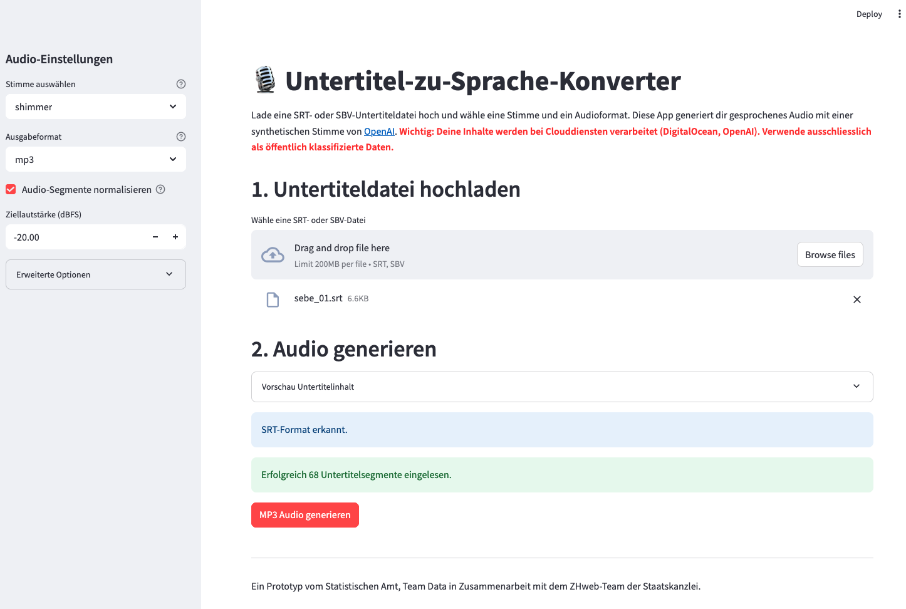

# Subtitle to Speech

**Convert subtitle files into synchronized German language audio using OpenAI's Text-to-Speech (TTS) API.**


[](https://github.com/machinelearningZH/subtitle-to-speech)
[](https://github.com/machinelearningZH/subtitle-to-speech/stargazers)
[](https://github.com/machinelearningZH/subtitle-to-speech/issues)
[](https://github.com/machinelearningZH/subtitle-to-speech/pulls)
[](https://github.com/machinelearningZH/subtitle-to-speech)
[](https://github.com/astral-sh/ruff)



## Features

* **Accessibility-First**: Designed to enhance the accessibility of videos, the tool is particularly useful for adding spoken audio to sign language content, for instance, like in this [video](https://www.zh.ch/de-gs/gesundheit/notfall-rettung.html).
* **Subtitle support**: Parses both `.srt` and `.sbv` subtitle formats.
* **High-Quality speech**: Uses OpenAI’s TTS API with support for multiple expressive voices that perform well in German.
* **Timing preservation**: Retains original subtitle timings and inserts silent breaks where necessary.
* **Customizable silence padding**: Adds silent breaks after subtitle segments for improved flow.
* **Volume normalization**: Optionally normalize loudness across segments for consistency.
* **Flexible output formats**: Exports to various formats (e.g., WAV, MP3) using [`pydub`](https://github.com/jiaaro/pydub).

## Prerequisites

* **OpenAI API Key**
* **`ffmpeg`**: Required by `pydub` to process audio files.

  Install `ffmpeg`:

  * **macOS (Homebrew)**: `brew install ffmpeg`
  * **Ubuntu/Debian**: `sudo apt update && sudo apt install ffmpeg`

## Installation

Clone the repository and set up the virtual environment using [`uv`](https://github.com/astral-sh/uv):

```bash
git clone https://github.com/machinelearningZH/subtitle-to-speech.git
cd subtitle-to-speech

pip3 install uv
uv venv
source .venv/bin/activate
uv sync
```

## Configuration

Set your OpenAI API key as an environment variable:

```bash
export OPENAI_API_KEY='your_api_key_here'
```

You can customize the voice style by modifying the prompt in `utils.py`.

## Running the App

To start the Streamlit app:

```bash
streamlit run subtitle-to-speech.py
```

Access the app at `http://127.0.0.1:8501`

> [!IMPORTANT]  
> The app starts to create the audio from **timecode 00:00:00** (not e.g. 01:00:00). Make sure that this is the starting timecode of your subtitle file and video. Otherwise you have to adjust the code.

> [!NOTE]
> Set the value for maximum parallel threads based on your tier on OpenAI's developer platform. Higher tiers offer increased rate limits, allowing faster data processing. However, setting too many parallel calls may still exceed your rate limits, so adjust accordingly.

## Project Team

* **Simone Luchetta** — [Staatskanzlei Zürich: Team Informationszugang & Dialog](https://www.zh.ch/de/staatskanzlei/digitale-verwaltung/team.html)
* **Chantal Amrhein**, **Patrick Arnecke** — [Statistisches Amt Zürich: Team Data](https://www.zh.ch/de/direktion-der-justiz-und-des-innern/statistisches-amt/data.html)

## Feedback and Contributing

We welcome feedback and contributions. [Email us](mailto:datashop@statistik.zh.ch) or open an issue or pull request.

We use [Ruff](https://docs.astral.sh/ruff/) for linting and code formatting.

Install pre-commit hooks for automatic checks before opening a pull request:

```bash
pre-commit install
```

## License

This project is licensed under the MIT License. See [LICENSE](LICENSE) for details.

## Disclaimer

This software (the Software) has been developed according to and with the intent to be used under Swiss law. Please be aware that the EU Artificial Intelligence Act (EU AI Act) may, under certain circumstances, be applicable to your use of the Software. You are solely responsible for ensuring that your use of the Software complies with all applicable local, national and international laws and regulations. By using this Software, you acknowledge and agree (a) that it is your responsibility to assess which laws and regulations, in particular regarding the use of AI technologies, are applicable to your intended use and to comply therewith, and (b) that you will hold us harmless from any action, claims, liability or loss in respect of your use of the Software.
